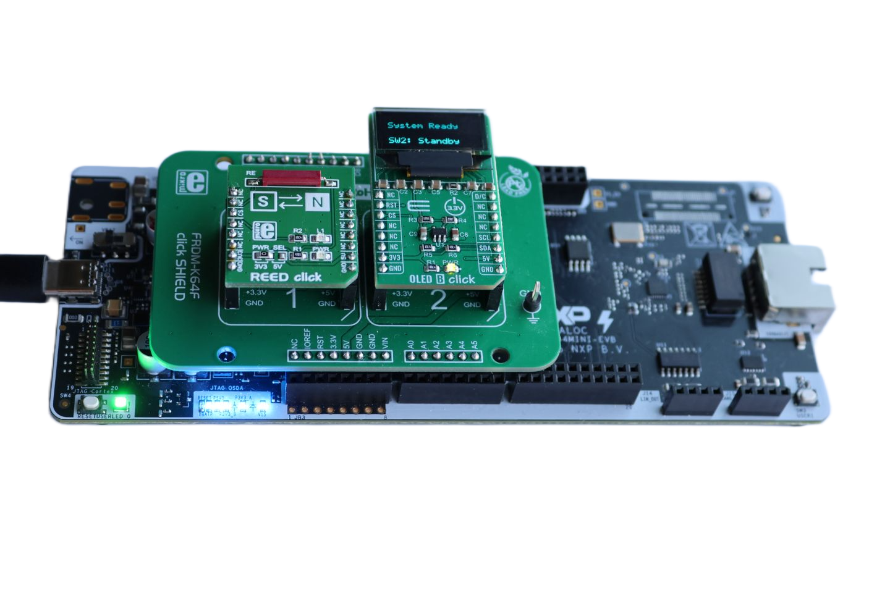
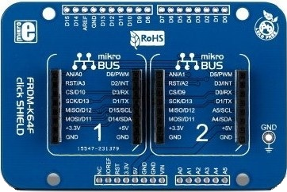
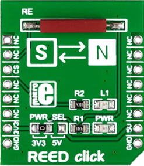
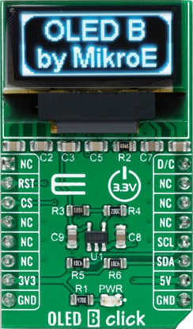
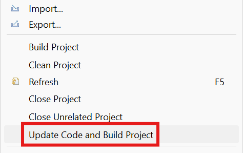
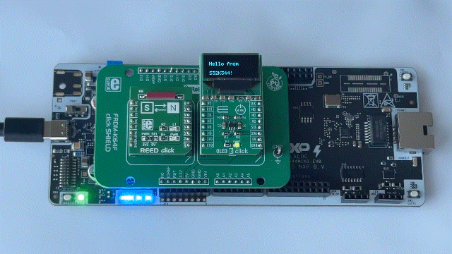

# NXP Application Code Hub

## Low-Power Magnetic Detection With WKPU Peripheral
This application demonstrates efficient power management techniques for the S32K344 MCU, utilizing the WKPU peripheral to wake from Standby mode upon magnetic field changes detected by a reed switch. The system integrates an SSD1306 OLED display via FlexIO I2C for status visualization, LED alarm indication, and supports both FAST and NORMAL wake-up modes for optimized power consumption. It is designed as a reference implementation for door/window monitoring applications using NXP S32K3 Real-Time Drivers.

[

](./images/FRDM-A-S32K344_Reed_Wakeup.png)

#### Boards: FRDM-A-S32K344
#### Categories: Low Power
#### Peripherals: I2C, GPIO
#### Toolchains: S32 Design Studio IDE

## Table of Contents
1. [Software and Tools](#step1)
2. [Hardware](#step2)
3. [Setup](#step3)
4. [Results](#step4)
5. [Support](#step5)
6. [Release Notes](#step6)

## 1. Software and Tools
This example was developed using the FRDM Automotive Bundle for S32K3 + S32M27. To download and install the complete software and tools ecosystem, use the following link: 
- [FRDM Automotive S32K3 + S32M27 Board Installation Package](https://www.nxp.com/app-autopackagemgr/automotive-software-package-manager:AUTO-SW-PACKAGE-MANAGER?currentTab=0&selectedDevices=S32K3&applicationVersionID=203)

## 2. Hardware
### 2.1 Required Hardware
- Personal Computer
- Type-C USB cable

| Boards | Images |
| ----------- | ------- |
| - [FRDM-A-S32K344](https://www.nxp.com/design/design-center/development-boards-and-designs/FRDM-A-S32K344) |  |
| - [FRDM K64 click shield](https://www.mikroe.com/frdm-k64-click-shield) | 
 |
| - [Reed Click](https://www.mikroe.com/reed-click)   - [OLED B Click](https://www.mikroe.com/oled-b-click) | 
  |

### 2.2 Hardware Connections
| FRDM-A-S32K344   | Header Pin |I/O| FRDM Shield  | Click Board    | Click Pin | Description  |
|------------------|------------|---|--------------|----------------|-----------|--------------|
| CS               | J2 pin 6   | ← | CS/D10       | Reed Click     | CS        | GPIO pin     |
| GND              | JA3 pin 13 | → | GND          | Reed Click     | GND       | Ground       |
| VDD_PERH         | JA3 pin 7  | → | 3.3V         | Reed Click     | 3V3       | Power Supply |
| PTA3 GPIO        | JA1 pin 11 | ← | D5           | OLED B Click   | D/C       | I2C Slave Address Selection Pin|
| PTA13 GPIO       | J4 pin 5   | ← | A2           | OLED B Click   | RST       | Reset Pin    |
| PTC10 GPIO       | J2 pin 3   | ← | D9           | OLED B Click   | CS        | Communication Enable Pin|
| PTA14 FlexIO_D3  | J4 pin 11  | → | A4           | OLED B Click   | SDA       | FlexIO I2C SDA Pin  |
| PTE0 FlexIO_D14  | J4 pin 9   | → | A5           | OLED B Click   | SCL       | FlexIO I2C SCL Pin  |
| GND              | JA3 pin 11 | → | GND          | OLED B Click   | GND       | Ground       |
| VDD_PERH         | JA3 pin 7  | → | 3.3V         | OLED B Click   | 3V3       | Power Supply |

### 2.3 Debugger Connection
- Connect the Type-C USB cable to PC and FRDM-A-S32K344 board for power supply and debugging.

## 3. Setup

### 3.1 Import the Project into S32 Design Studio IDE
1. Open S32 Design Studio IDE, in the Dashboard Panel, choose **Import project from Application Code Hub**.
[

](./images/import_project_1.png)

2. You can find the demo you need by searching for the name directly. Open the project, click the **GitHub link** from this window, S32 Design Studio IDE will automatically retrieve project attributes then click **Next>**.
[

](./images/import_project_3.png)

3. Select **main** branch and then click **Next>**.
4. Select your local path for the repo in **Destination->Directory** window. The S32 Design Studio IDE will clone the repo into this path, click **Next>**.

5. Select **Import existing Eclipse projects** then click **Next>**.

6. Select the project in this repo (only one project in this repo) then click **Finish**.
### 3.2 Generating, Building and Running the Example
1. In Project Explorer, right-click the project and select **Update Code and Build Project**. This will generate the configuration (Pins, Clocks, Peripherals), update the source code and build the project using the active configuration (e.g. Debug_FLASH).
Make sure the build completes successfully and the *.elf file is generated without errors.
[

](./images/update_and_build.png)
Press **Yes** in the **SDK Component Management** pop-up window to continue.

2. Go to **Debug** and select **Debug Configurations**. There will be a debug configuration for this project:
[

](./images/Debug_config.png)

        Configuration Name                  Description
        -------------------------------     -----------------------
        $(example)_debug_flash_pemicro      Debug the FLASH configuration using PEmicro probe

    Select the desired debug configuration and click on **Debug**. Now the perspective will change to the **Debug Perspective**.
    Use the controls to control the program flow.

## 4. Results
The demo combines a reed switch connected to WKPU18 (PTB26) with an SSD1306 OLED display (via FlexIO I2C) and a green LED indicator to deliver a low-power standby wake-up demonstration:

[

](./images/FRDM-A-S32K344_Reed_Wakeup_Result.gif)

- **Startup:** On cold start, the SSD1306 OLED display shows the current reed switch state.

- **Reed Switch Monitoring:** The main loop continuously polls the WKPU18 input state register to read the logic level on PTB26. When the state changes, the OLED display is updated:
  - `State: CLOSED` - when the magnet is near (door closed / secure).
  - `State: OPEN` - when the magnet is removed (door open / alarm condition).

- **Standby Entry:** Pressing SW2 updates the OLED to show `Standby: ARMED`, displays an "Entering Standby..." screen, turns off the green LED, arms WKPU18 as the wake-up source, and puts the MCU into standby mode. The OLED is then blanked to save power.

- **Wake-up Detection:** When the reed switch is triggered (magnet removed / magnetic field no longer detected on PTB26 / WKPU18), the MCU wakes up:
  - On **FAST** wake-up, the MCU resets and restarts from the top of `main()`, the OLED shows a "Woke up! / WKPU18 event" screen, and the LED turns back on as an alarm indicator.
  - On **NORMAL** wake-up, execution resumes after the standby call, the OLED is re-initialized, shows the wake-up screen, and the LED is turned back on.

## 5. Support
For general technical questions related to NXP microcontrollers, please use the *NXP Community Forum*.

#### Project Metadata

<!----- Boards ----->

<!----- Categories ----->

<!----- Peripherals ----->

<!----- Toolchains ----->

Questions regarding the content/correctness of this example can be entered as Issues within this GitHub repository.

>**Note**: For more general technical questions regarding NXP Microcontrollers and the difference in expected functionality, enter your questions on the [NXP Community Forum](https://community.nxp.com/)

## 6. Release Notes
| Version | Description / Update                           | Date                        |
|:-------:|------------------------------------------------|----------------------------:|
| 1.0     | Initial release on Application Code Hub        | August 12th 2026 |
| 1.1     | Updated to FRDM Automotive S32K3 + S32M27 (RTD 7.0.1)        |August 26th 2026|
